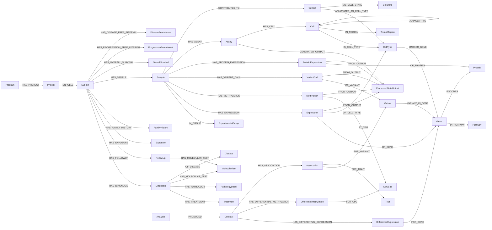

# LifeSphere Knowledge-Graph Schema

## 1. Overview, Scope, and Schema Authority

### 1.1 Overview

The LifeSphere knowledge graph is a provenance-aware, multi-omics biomedical data
representation layer built to harmonise cancer-study data (clinical + biospecimen +
omics) from the GDC into a single Neo4j knowledge graph suitable for cohort querying,
molecular retrieval, and agentic Text-to-Cypher applications. It integrates clinical
metadata, sample/biospecimen provenance, high-resolution molecular observations
(transcriptomics, epigenomics, somatic variation, proteomics), single-cell and spatial
representations, derived survival endpoints, and derived analysis results into one
graph, alongside a shared reference dimension of stable biological entities (`Gene`,
`Protein`, `Pathway`, `Variant`, `CpGSite`, `CellType`, `Disease`).

For readers unfamiliar with Neo4j graph modelling, see the Neo4j introduction to
[graph data modelling](https://neo4j.com/docs/getting-started/data-modeling/).

This document is the implementation reference for the graph the LifeSphere pipeline
actually emits. It describes the model as encoded in the configuration, not an
aspirational target.

### 1.2 Current Scope and Goals

At the current stage, the LifeSphere graph is a representation and retrieval layer. It
stores structured clinical metadata, sample-specific molecular observations,
source-provided annotations, external matrix/file pointers, and reproducibility
information. Two derived layers exist — **survival endpoints** (OS / PFI / DFI, computed
per subject) and **analysis results** (differential expression / methylation and
variant–trait associations). Where a value is derived, it is anchored to an explicit
provenance node (`Analysis`, a survival reshape) so that it is never mistaken for a raw
source field.

Key goals:

- **Separate stable entities from observations.** Reusable biological entities such as
  `Gene`, `Protein`, `Pathway`, `Variant`, `CpGSite`, and `CellType` are kept distinct
  from sample-specific measurements such as `Expression`, `Methylation`, `VariantCall`,
  and `ProteinExpression`.
- **Preserve grain and provenance.** Each source table maps 1:1 to a node type at its
  true grain; identifiers, aliquot/file provenance, and source values are retained.
- **Keep large matrices external.** Dense molecular matrices (methylation arrays,
  RNA-seq matrices, single-cell count matrices) remain outside Neo4j and are represented
  through `ProcessedDataOutput` file pointers.
- **Represent single-cell scalably.** Dissociated single-cell data is represented through
  `CellSet`, `CellType`, and `CellState`; per-cell `Cell` nodes exist only for spatial
  assays, where topology is the point.
- **Enable schema-aware agentic retrieval.** The graph is structured so an AI agent can
  traverse entities, observations, provenance, and external pointers using reliable
  Cypher patterns.

Out of scope for the current graph: the graph does not itself perform enrichment,
deconvolution, trajectory/pseudotime inference, or marker discovery. Analytical values
that appear (e.g. `log2fc`, `padj`) are ingested from an upstream analysis and carried on
`AnalysisResult` subclasses with their `Analysis` provenance, never computed inside Neo4j.

### 1.3 Source of Truth

The authoritative encoding of this schema is the configuration set, and no code change is
required to add, remove, or rename a standard node/edge:

| File | Controls |
|------|----------|
| `config/schemas/entities.json` | node types: source file, label, id column, prefix strip, drop/keep, dedup |
| `config/schemas/edges.json` | edge types: label, source entity, source id, target id, edge props, dedup |
| `config/schemas/aliases.json` | raw-column → canonical-column aliasing |
| `config/schemas/placeholders.json` | tokens scrubbed to empty string |
| `config/schema_config.yaml` | BioCypher ontology: `input_label`, `preferred_id`, `is_a`, source/target |

The narrative model is documented in
[`docs/dev_guides/kg_data_model.md`](../dev_guides/kg_data_model.md); the change procedure
is in [`docs/dev_guides/change_schema.md`](../dev_guides/change_schema.md). The Stage-1
(JSON) and Stage-2 (YAML) configs must stay in sync — see the cross-file invariants in
Section 2.6.

## 2. Design Principles

### 2.1 Naming Conventions

The schema follows Neo4j/Cypher
[naming rules](https://neo4j.com/docs/cypher-manual/current/syntax/naming/) with one
deliberate LifeSphere choice: **properties are `snake_case`**, mirroring the GDC source
columns after prefix stripping, so that provenance from source field to graph property
stays legible.

- **Node labels:** `PascalCase`, e.g. `MolecularTest`, `CpGSite`, `ProcessedDataOutput`,
  `DifferentialExpression`.
- **Relationship types:** `UPPER_SNAKE_CASE`, e.g. `HAS_DIAGNOSIS`, `OF_GENE`,
  `ANNOTATED_AS_CELL_TYPE`, `HAS_OVERALL_SURVIVAL`.
- **Properties:** `snake_case`, e.g. `ajcc_pathologic_stage`, `beta_value`, `time_days`,
  `ontology_mapping_status`.
- **Stable identifiers:** primary keys end in `_id` (`case_id`, `sample_id`,
  `expression_id`, `cell_set_id`) or are natural ids (`ensembl`, `uniprot`, `cpg`,
  `program_name`).
- **Property prefix stripping:** standardisation strips the source entity prefix from
  content columns, so `diagnosis_ajcc_pathologic_stage → ajcc_pathologic_stage` and
  `demographic_sex_at_birth → sex_at_birth`.

> **Implementation note:** the graph uses `snake_case` properties throughout. The
> aspirational `camelCase` model in `neo4j_updated_schema_draft_3.md` is a separate design
> draft; this document reflects what the pipeline actually loads.

### 2.2 One Table, One Grain, One Node

The core structural rule is that **grain is preserved 1:1** from the source table to the
node CSV. The GDC extractor emits one TSV per entity at its true 1:many grain
(`{base}.{entity}.tsv`), and standardisation renames and cleans columns without
re-pivoting. Consequently:

- **1:1 → property; 1:many → node.** An entity that is strictly one-per-parent is folded
  into the parent's properties (e.g. `demographic` becomes `Subject` properties); a
  one-to-many entity becomes its own node (`FollowUp`, `Treatment`, `Sample`, …).
- **`dedup: true` collapses rows on the id column.** Reference dimensions repeated across
  many rows (`Program`, `Project`, `Gene`, `Pathway`, `Disease`, `CellType`) are
  deduplicated to one node per id. Grain-bearing tables (`Subject`, `Diagnosis`, every
  observation node) are not deduplicated.

### 2.3 Stable Entities vs Observation Nodes

Measurements — expression counts, methylation beta values, somatic variant calls, protein
abundances — are modelled as **stand-alone observation nodes**, never as properties on a
`Sample → feature` edge.

```cypher
(:Sample)-[:HAS_EXPRESSION]->(:Expression {tpm, fpkm})-[:OF_GENE]->(:Gene)
```

Reasons:

- **Stable entities stay stable.** A `Gene`, `CpGSite`, `Variant`, or `Protein` is a
  reusable, deduplicated reference entity shared across every sample; it must not carry a
  sample-specific value.
- **Measurements are context-specific.** A beta value or TPM depends on the sample,
  aliquot, source file, and pipeline. Those belong on the observation node.
- **No engine change and robust indexing.** Because values live on nodes (which already
  pass properties through), every measurement edge stays a plain `source_id, target_id`
  pair, and Neo4j node-property indexes apply directly to the values.

The measurement count is identical to a valued-edge model (one element per
sample × feature); reification adds one node and one hop but buys indexable node
properties and a place to attach further provenance (`FROM_OUTPUT` to a
`ProcessedDataOutput`).

### 2.4 Shared Reference Dimensions

Feature nodes are a **deduplicated reference dimension** reused across all samples and,
crucially, **across all derived layers**. The same shared `Gene` node is the target of
both the omics measurement edge `OF_GENE` and the analysis-result edge `FOR_GENE`;
likewise `CpGSite` is shared by `AT_CPG` / `FOR_CPG`, and `Variant` by `OF_VARIANT` /
`FOR_VARIANT`. This lets a query pivot from a differential-expression hit straight to the
per-sample expression observations of the same gene without a join.

Feature nodes are populated from dedicated reference TSVs (one source file per label,
since two plans writing the same label would clobber the output), while each measurement
TSV yields its observation node plus both of its edges.

### 2.5 Subclassing via `is_a`

Two families of nodes share a property schema and are modelled as **subclasses of an
abstract superclass** using BioCypher's `is_a`:

- **`SurvivalOutcome`** → `OverallSurvival`, `ProgressionFreeInterval`,
  `DiseaseFreeInterval`. All share `outcome_type`, `event`, `time_days`.
- **`AnalysisResult`** → `DifferentialExpression`, `DifferentialMethylation`,
  `Association`. All share `pvalue`, `direction`, `significant`.

Each subclass **must keep a distinct `id_col`** (`os_id`/`pfi_id`/`dfi_id`;
`de_id`/`dmp_id`/`assoc_id`), because the loader keys node labels by id column — a shared
id column would collapse the subclasses into one label. The abstract superclass is not
instantiated directly.

### 2.6 Provenance, Config, and Cross-File Invariants

Ingestion logic is separated from biological data. Because the schema is config-driven,
the Stage-1 JSON and Stage-2 YAML views must agree, enforced by these invariants:

- `entities.json.label` == `schema_config` `input_label`
- `entities.json.id_col` == `schema_config` `preferred_id`
- `edges.json.label` == edge `input_label`
- an edge's `target_id` == the target node's `id_col`

**Placeholder scrub.** GDC/BCR placeholder tokens are treated as null and dropped, so no
node or edge property ever carries a sentinel string. The scrubbed set includes `--`,
`[Not Available]`, `[Not Evaluated]`, `[Unknown]`, `[Not Applicable]`, `[Not Reported]`,
`[Discrepancy]`, `[Completed]`, `[Pending]`, and case variants of `unknown` /
`not reported`.

**Column aliasing.** Raw columns are mapped to canonical names before matching, e.g.
`bcr_patient_uuid`/`case_uuid` → `case_id`, `project.project_id` → `project_id`.

**Never fail hard on missing data.** If a schema entry's source file or a required id/FK
column is absent, standardisation logs a skip and moves on. Schema definitions may safely
describe entities not present in every dataset (e.g. a clinical-only dataset produces no
omics nodes). A skip is a bug only when the column *should* have been there.

### 2.7 External Matrix and File Storage

Complete matrices, dense or sparse, remain outside Neo4j to preserve performance.

- `ProcessedDataOutput` nodes store the external file pointer and metadata
  (`file_format`, `file_path`, `checksum`, `matrix_shape`).
- Bulk and methylation matrices remain external; graph-resident observations are
  materialised only where query-critical.
- Single-cell `.h5ad` / count matrices remain the authoritative container; Neo4j does not
  store per-cell rows for dissociated scRNA. The dense cell × feature matrix is referenced
  via `matrix_uri` on the `Assay` and/or a `ProcessedDataOutput`.
- An observation links back to the file it was materialised from via
  `(:Observation)-[:FROM_OUTPUT]->(:ProcessedDataOutput)`, and an assay to its outputs via
  `(:Assay)-[:GENERATED_OUTPUT]->(:ProcessedDataOutput)`.

## 3. Core Schema Backbone

Relationship paths use standard Cypher path-pattern syntax. Direction is parent → child.

### 3.1 Clinical Backbone

The clinical spine runs `Program → Project → Subject → {branches}`. Diagnosis and Sample
are **parallel branches off Subject**, not a chain — the GDC has no FK from Sample to
Diagnosis; both are children of the case.

```cypher
(:Program)-[:HAS_PROJECT]->(:Project)
(:Project)-[:ENROLLS]->(:Subject)

(:Subject)-[:HAS_DIAGNOSIS]->(:Diagnosis)
(:Subject)-[:HAS_FOLLOWUP]->(:FollowUp)
(:Subject)-[:HAS_EXPOSURE]->(:Exposure)
(:Subject)-[:HAS_FAMILY_HISTORY]->(:FamilyHistory)
(:Subject)-[:HAS_SAMPLE]->(:Sample)

(:Diagnosis)-[:HAS_TREATMENT]->(:Treatment)
(:Diagnosis)-[:HAS_PATHOLOGY]->(:PathologyDetail)
(:Sample)-[:IN_GROUP]->(:ExperimentalGroup)
```

`MolecularTest` is **dual-parented**: its `parent_entity` selects whether the edge
originates from a `Diagnosis` or a `FollowUp`, with `parent_id` naming the source node.

```cypher
(:Diagnosis)-[:HAS_MOLECULAR_TEST]->(:MolecularTest)
(:FollowUp)-[:HAS_MOLECULAR_TEST]->(:MolecularTest)
```

### 3.2 Disease Reference

The stable, ontology-backed `Disease` concept is split from the per-record `Diagnosis`,
enabling cross-dataset disease queries.

```cypher
(:Diagnosis)-[:OF_DISEASE]->(:Disease)
```

### 3.3 Molecular Observation Backbone

Each measurement is a reified observation linking a `Sample` to the shared feature it
measures. Feature nodes are deduplicated and reused across all samples.

```cypher
(:Sample)-[:HAS_EXPRESSION]->(:Expression)-[:OF_GENE]->(:Gene)
(:Sample)-[:HAS_METHYLATION]->(:Methylation)-[:AT_CPG]->(:CpGSite)
(:Sample)-[:HAS_VARIANT_CALL]->(:VariantCall)-[:OF_VARIANT]->(:Variant)
(:Sample)-[:HAS_PROTEIN_EXPRESSION]->(:ProteinExpression)-[:OF_PROTEIN]->(:Protein)
```

Pseudobulk single-cell expression folds into the **same** `Expression` node, distinguished
by `assay_type = pseudobulk` and an extra cell-type edge:

```cypher
(:Expression)-[:OF_CELL_TYPE]->(:CellType)
```

Static biology (Omnipath-shaped reference annotations, all property-free edges):

```cypher
(:Variant)-[:VARIANT_IN_GENE]->(:Gene)
(:Gene)-[:IN_PATHWAY]->(:Pathway)
(:Gene)-[:ENCODES]->(:Protein)
```

Observation-to-file provenance:

```cypher
(:Assay)-[:GENERATED_OUTPUT]->(:ProcessedDataOutput)
(:Expression|:Methylation|:VariantCall|:ProteinExpression)-[:FROM_OUTPUT]->(:ProcessedDataOutput)
```

### 3.4 Single-Cell and Spatial Backbone

A single-cell / spatial run adds an observational unit **below the sample**. The dense
matrix stays external; the graph holds the assay, per-cell annotations (spatial only),
spatial topology, and tractable aggregates.

```cypher
(:Sample)-[:HAS_ASSAY]->(:Assay)
(:Assay)-[:GENERATED_OUTPUT]->(:ProcessedDataOutput)

// Dissociated scRNA — CellSet aggregates, no per-cell nodes
(:Sample)-[:CONTRIBUTES_TO]->(:CellSet)
(:CellSet)-[:ANNOTATED_AS_CELL_TYPE]->(:CellType)
(:CellSet)-[:HAS_CELL_STATE]->(:CellState)
(:CellType)-[:MARKER_GENE]->(:Gene)

// Spatial — per-cell nodes with topology
(:Assay)-[:HAS_CELL]->(:Cell)
(:Cell)-[:IS_CELL_TYPE]->(:CellType)
(:Cell)-[:IN_REGION]->(:TissueRegion)
(:Cell)-[:ADJACENT_TO]->(:Cell)
```

`CellState` is always its own node, never a `CellType` property, to avoid
global-overwrite and combinatorial explosion of state-tagged cell types.

### 3.5 Survival-Outcome Backbone

Three standard endpoints are derived per subject and attached directly to the `Subject`.

```cypher
(:Subject)-[:HAS_OVERALL_SURVIVAL]->(:OverallSurvival)
(:Subject)-[:HAS_PROGRESSION_FREE_INTERVAL]->(:ProgressionFreeInterval)
(:Subject)-[:HAS_DISEASE_FREE_INTERVAL]->(:DiseaseFreeInterval)
```

Each is a subclass of `SurvivalOutcome` carrying `outcome_type`, `event`, `time_days`.

### 3.6 Analysis-Result Backbone

A derived differential/association result is reified like a measurement, but anchored to a
`Contrast` (a cohort comparison) rather than a `Sample`, and reuses the **same shared
feature nodes** the omics layer populates.

```cypher
(:Analysis)-[:PRODUCED]->(:Contrast)
(:Contrast)-[:HAS_DIFFERENTIAL_EXPRESSION]->(:DifferentialExpression)-[:FOR_GENE]->(:Gene)
(:Contrast)-[:HAS_DIFFERENTIAL_METHYLATION]->(:DifferentialMethylation)-[:FOR_CPG]->(:CpGSite)
(:Contrast)-[:HAS_ASSOCIATION]->(:Association)-[:FOR_VARIANT]->(:Variant)
(:Association)-[:FOR_TRAIT]->(:Trait)
```

### 3.7 Visual Schema Overview

The diagram is a simplified, non-exhaustive overview. The node catalogue (Section 4),
relationship catalogue (Section 5), and property catalogues (Sections 7–8) remain
authoritative.



## 4. Node Definitions

IDs are GDC UUIDs unless noted. Property lists are representative — the full content
column set of each source TSV carries through (prefix-stripped) unless pruned.

### 4.1 Clinical Nodes

| Node Label | Description | Key Identifier | Dedup |
|---|---|---|---|
| `Program` | Top-level GDC program (e.g. TCGA). | `program_name` | yes |
| `Project` | Study/cohort within a program (e.g. TCGA-BRCA). | `project_id` | yes |
| `Subject` | Biological source (patient/donor). Standardised rename of GDC `case`; folds `demographic_*` in as properties. | `case_id` | no |
| `Diagnosis` | A cancer diagnosis record for a subject. | `diagnosis_id` | no |
| `Treatment` | A treatment given for a diagnosis. | `treatment_id` | no |
| `PathologyDetail` | Pathology detail record attached to a diagnosis. | `pathology_detail_id` | no |
| `FollowUp` | A clinical follow-up record for a subject. | `follow_up_id` | no |
| `MolecularTest` | Clinical molecular/biomarker test (ER/PR/HER2, etc.); dual-parented to Diagnosis or FollowUp. | `molecular_test_id` | no |
| `Exposure` | Exposure/lifestyle record (smoking, alcohol, BMI). | `exposure_id` | no |
| `FamilyHistory` | Family cancer-history record. | `family_history_id` | no |
| `Sample` | Physical biospecimen at **aliquot** grain (the analysed unit omics files map to). | `sample_id` | no |
| `ExperimentalGroup` | Coarse control/treatment arm, derived from `sample_type`. | `group_id` | yes |
| `Disease` | Stable ontology-backed disease concept (MONDO / NCIt / DOID). | `disease_id` | yes |

### 4.2 Omics Feature Nodes (shared, deduplicated)

| Node Label | Description | Key Identifier |
|---|---|---|
| `Gene` | Stable gene reference entity, keyed by Ensembl id. | `ensembl` |
| `CpGSite` | CpG locus / methylation probe. | `cpg` |
| `Variant` | Stable genomic alteration (SNV, indel, CNV, …). | `variant_id` |
| `Protein` | Stable protein reference entity, keyed by UniProt. | `uniprot` |
| `Pathway` | Curated biological pathway / gene set. | `pathway_id` |

### 4.3 Omics Observation Nodes (per sample × feature)

| Node Label | Description | Key Identifier |
|---|---|---|
| `Expression` | Gene-expression measurement; `assay_type ∈ {bulk, pseudobulk}`. | `expression_id` |
| `Methylation` | DNA-methylation measurement (beta value) at a CpG. | `methylation_id` |
| `VariantCall` | Sample-specific evidence that a variant was observed (VAF, consequence, impact). | `variant_call_id` |
| `ProteinExpression` | Protein-abundance measurement (e.g. RPPA). | `protein_expression_id` |

### 4.4 Single-Cell and Spatial Nodes

| Node Label | Description | Key Identifier | Dedup |
|---|---|---|---|
| `Assay` | Assay instance below the sample; holds `matrix_uri`, modality, platform. | `assay_id` | no |
| `Cell` | Single cell — **spatial assays only** (x, y + `ADJACENT_TO`). | `cell_id` | no |
| `CellSet` | Reproducible cell group (cluster / cell-type population); the scalable dissociated-scRNA unit. | `cell_set_id` | yes |
| `CellType` | Cell Ontology (`CL:####`) reference entity. | `cell_type_id` | yes |
| `CellState` | Context-specific state (Exhausted, Hypoxic); separate node. | `cell_state_id` | yes |
| `TissueRegion` | Spatial niche / anatomical region (UBERON or per-assay id). | `region_id` | yes |
| `ProcessedDataOutput` | External file/matrix pointer (format, path, checksum, shape). | `output_id` | yes |

### 4.5 Survival Nodes

| Node Label | Superclass | Description | Key Identifier |
|---|---|---|---|
| `SurvivalOutcome` | — | Abstract superclass; shared property schema. | `survival_id` |
| `OverallSurvival` | `SurvivalOutcome` | OS endpoint (event = subject died). | `os_id` |
| `ProgressionFreeInterval` | `SurvivalOutcome` | PFI endpoint (event = progression/recurrence/death). | `pfi_id` |
| `DiseaseFreeInterval` | `SurvivalOutcome` | DFI endpoint (event = recurrence). | `dfi_id` |

### 4.6 Analysis-Result Nodes

| Node Label | Superclass | Description | Key Identifier |
|---|---|---|---|
| `Analysis` | — | Provenance root: how a result was produced (method, software version, genome build). | `analysis_id` |
| `Contrast` | — | The cohort comparison a result is anchored to (group_a/group_b, n, stratify_on). | `contrast_id` |
| `Trait` | — | GWAS phenotype; shared, ontology-mapped dimension (EFO / MONDO). | `trait_id` |
| `AnalysisResult` | — | Abstract superclass; shared property schema (pvalue, direction, significant). | `result_id` |
| `DifferentialExpression` | `AnalysisResult` | Per-gene differential-expression result (log2fc, base_mean, padj). | `de_id` |
| `DifferentialMethylation` | `AnalysisResult` | Per-CpG differential-methylation result (delta_beta, status). | `dmp_id` |
| `Association` | `AnalysisResult` | GWAS variant–trait association (effect, se, eaf, n). | `assoc_id` |

## 5. Relationship Definitions

Direction is parent → child. Each edge is derived from FK columns already present in a
single source TSV (no joins). `dedup: true` collapses repeated edges.

### 5.1 Clinical Relationships

| Edge | From → To | source_id → target_id | Dedup |
|---|---|---|---|
| `HAS_PROJECT` | Program → Project | program_name → project_id | yes |
| `ENROLLS` | Project → Subject | project_id → case_id | no |
| `HAS_DIAGNOSIS` | Subject → Diagnosis | case_id → diagnosis_id | no |
| `HAS_TREATMENT` | Diagnosis → Treatment | diagnosis_id → treatment_id | no |
| `HAS_PATHOLOGY` | Diagnosis → PathologyDetail | diagnosis_id → pathology_detail_id | no |
| `HAS_FOLLOWUP` | Subject → FollowUp | case_id → follow_up_id | no |
| `HAS_MOLECULAR_TEST` | Diagnosis **or** FollowUp → MolecularTest | parent_id → molecular_test_id | no |
| `HAS_EXPOSURE` | Subject → Exposure | case_id → exposure_id | no |
| `HAS_FAMILY_HISTORY` | Subject → FamilyHistory | case_id → family_history_id | no |
| `HAS_SAMPLE` | Subject → Sample | case_id → sample_id | no |
| `IN_GROUP` | Sample → ExperimentalGroup | sample_id → group_id | no |
| `OF_DISEASE` | Diagnosis → Disease | diagnosis_id → disease_id | no |

### 5.2 Molecular Observation Relationships

| Edge | From → To | source_id → target_id |
|---|---|---|
| `HAS_EXPRESSION` | Sample → Expression | sample_id → expression_id |
| `OF_GENE` | Expression → Gene | expression_id → gene_ensembl |
| `OF_CELL_TYPE` | Expression → CellType | expression_id → cell_type_id (pseudobulk only) |
| `HAS_METHYLATION` | Sample → Methylation | sample_id → methylation_id |
| `AT_CPG` | Methylation → CpGSite | methylation_id → cpg |
| `HAS_VARIANT_CALL` | Sample → VariantCall | sample_id → variant_call_id |
| `OF_VARIANT` | VariantCall → Variant | variant_call_id → variant_id |
| `HAS_PROTEIN_EXPRESSION` | Sample → ProteinExpression | sample_id → protein_expression_id |
| `OF_PROTEIN` | ProteinExpression → Protein | protein_expression_id → uniprot |

Because `standardise_edge` skips blank FKs, `OF_CELL_TYPE` materialises **only** for
pseudobulk `Expression` rows; bulk rows leave `cell_type_id` empty.

### 5.3 Static Biology Relationships

| Edge | From → To | source_id → target_id | Dedup |
|---|---|---|---|
| `VARIANT_IN_GENE` | Variant → Gene | variant_id → gene_ensembl | yes |
| `IN_PATHWAY` | Gene → Pathway | gene_ensembl → pathway_id | yes |
| `ENCODES` | Gene → Protein | gene_ensembl → uniprot | yes |

### 5.4 Single-Cell, Spatial, and Provenance Relationships

| Edge | From → To | source_id → target_id | Edge props |
|---|---|---|---|
| `HAS_ASSAY` | Sample → Assay | sample_id → assay_id | — |
| `HAS_CELL` | Assay → Cell | assay_id → cell_id | — |
| `IS_CELL_TYPE` | Cell → CellType | cell_id → cell_type_id | — |
| `IN_REGION` | Cell → TissueRegion | cell_id → region_id | — |
| `ADJACENT_TO` | Cell → Cell | cell_id_a → cell_id_b | — (dedup) |
| `CONTRIBUTES_TO` | Sample → CellSet | sample_id → cell_set_id | contributed_cell_count, fraction_of_sample_cells |
| `ANNOTATED_AS_CELL_TYPE` | CellSet → CellType | cell_set_id → cell_type_id | source_value, ontology_mapping_status |
| `HAS_CELL_STATE` | CellSet → CellState | cell_set_id → cell_state_id | — |
| `MARKER_GENE` | CellType → Gene | cell_type_id → gene_ensembl | — (dedup) |
| `GENERATED_OUTPUT` | Assay → ProcessedDataOutput | assay_id → output_id | — |
| `FROM_OUTPUT` | Expression/Methylation/VariantCall/ProteinExpression → ProcessedDataOutput | observation_id → output_id | — (dedup) |

### 5.5 Survival Relationships

| Edge | From → To | source_id → target_id |
|---|---|---|
| `HAS_OVERALL_SURVIVAL` | Subject → OverallSurvival | case_id → os_id |
| `HAS_PROGRESSION_FREE_INTERVAL` | Subject → ProgressionFreeInterval | case_id → pfi_id |
| `HAS_DISEASE_FREE_INTERVAL` | Subject → DiseaseFreeInterval | case_id → dfi_id |

### 5.6 Analysis-Result Relationships

| Edge | From → To | source_id → target_id |
|---|---|---|
| `PRODUCED` | Analysis → Contrast | analysis_id → contrast_id |
| `HAS_DIFFERENTIAL_EXPRESSION` | Contrast → DifferentialExpression | contrast_id → de_id |
| `FOR_GENE` | DifferentialExpression → Gene | de_id → gene_ensembl |
| `HAS_DIFFERENTIAL_METHYLATION` | Contrast → DifferentialMethylation | contrast_id → dmp_id |
| `FOR_CPG` | DifferentialMethylation → CpGSite | dmp_id → cpg |
| `HAS_ASSOCIATION` | Contrast → Association | contrast_id → assoc_id |
| `FOR_VARIANT` | Association → Variant | assoc_id → variant_id |
| `FOR_TRAIT` | Association → Trait | assoc_id → trait_id |

The `FOR_*` edges deliberately target the **same shared feature nodes** as the omics
`OF_*` / `AT_*` edges; they differ in label only because Stage 1 writes one
`edges/{LABEL}.csv` per schema entry.

## 6. Domain-Specific Design

### 6.1 Clinical Layer

The clinical layer is driven entirely by `entities.json` / `edges.json`. Diagnosis and
Sample are parallel branches off Subject (no Sample↔Diagnosis FK in the GDC). `Subject` is
the rename of GDC `case`, with the 1:1 `demographic` table folded in as properties
(`sex_at_birth`, `race`, `ethnicity`, `vital_status`, `age_at_index`, `days_to_birth`,
`year_of_death`, `cause_of_death`, `days_to_death`). One-to-many clinical entities
(`FollowUp`, `Treatment`, `PathologyDetail`, `Exposure`, `FamilyHistory`, `MolecularTest`)
are their own nodes.

**Molecular-test routing.** `molecular_test.parent_entity ∈ {diagnosis, follow_up}` selects
the parent node; `parent_id` is the source node id. This is the one clinical entity needing
custom extraction logic (dual parent).

### 6.2 Omics Layer

- **Sample = aliquot.** The `Sample` node is the aliquot — the analysed unit omics files
  map to. Sample-level descriptors are grafted onto each aliquot row; `aliquot_id` becomes
  `sample_id`, and the originating GDC sample is retained as `gdc_sample_id`.
- **Reification.** Every measurement is a node between a `Sample` and a shared feature (see
  Section 2.3). All measurement edges are plain `source_id, target_id` pairs.
- **Reference files vs measurement files.** Feature nodes come from dedicated reference
  TSVs (one file per label). Each measurement TSV yields its observation node plus both
  edges. Static biology comes from edge-only TSVs (`gene_pathway`, `gene_protein`).
- **Provenance.** Every observation carries `aliquot_id` / `file_id`, and can link
  `FROM_OUTPUT` to a `ProcessedDataOutput`.

### 6.3 Single-Cell and Spatial Layer

- **Pseudobulk folds into `Expression`.** A pseudobulk value is a cell-type-stratified
  gene-expression observation — the same reified `Expression` node as bulk, tagged
  `assay_type = pseudobulk`, keyed `{sample_id}:{cell_type_id}:{gene_ensembl}`, carrying
  `mean_expr` / `pct_expressing` alongside `tpm`, and wired out with `OF_CELL_TYPE`. Bulk
  grain is `sample × gene`; pseudobulk grain is `sample × cell_type × gene`. Query
  bulk-only with `WHERE e.assay_type = 'bulk'`.
- **CellSet, not per-cell nodes, for dissociated scRNA.** Sample participation is
  `CONTRIBUTES_TO` (with `contributed_cell_count`, `fraction_of_sample_cells`), and cell
  typing is `ANNOTATED_AS_CELL_TYPE` (with `source_value`, `ontology_mapping_status`).
- **Per-cell `Cell` nodes are spatial-only**, where x/y coordinates and `ADJACENT_TO`
  topology are the point.
- **CellState** is its own node, never a `CellType` property.

**Edge properties.** An `edges.json` entry may declare `"props": [...]`, which
`standardise_edge` emits after `source_id, target_id` (placeholder-scrubbed, absent columns
dropped). This carries the `CONTRIBUTES_TO` and `ANNOTATED_AS_CELL_TYPE` qualifiers.
Deferred: `MARKER_GENE` score and `ADJACENT_TO` distance (plain edges for now).

### 6.4 Survival Layer

The GDC ships no precomputed survival endpoint. OS / PFI / DFI are derived per subject by a
post-extract reshape, following the TCGA Clinical Data Resource (Liu et al., Cell 2018)
adapted to GDC harmonized fields. All three are subclasses of `SurvivalOutcome` sharing
`outcome_type`, `event` (1 = event, 0 = censored), `time_days`.

| Endpoint | event = 1 when | time_days |
|---|---|---|
| `OverallSurvival` | subject died | `days_to_death`, else last contact (censored) |
| `ProgressionFreeInterval` | progression, recurrence, or death | earliest of those, else last contact |
| `DiseaseFreeInterval` | recurrence | `days_to_recurrence`, else last contact |

`last contact = max(diagnosis.days_to_last_follow_up, follow_up.days_to_follow_up)`.
Surrogate ids are deterministic (`{case_id}:OS|PFI|DFI`). A subject with no usable time for
an outcome is skipped rather than emitted with a null time. DFI here is a recurrence-based
approximation over all subjects (GDC carries no clean initial tumor-free flag).

### 6.5 Analysis-Result Layer

A differential/association result is reified like a measurement but anchored to a
`Contrast` — a cohort comparison (`group_a`, `group_b`, group sizes, `stratify_on`) — with
its provenance root `Analysis` (method, software version, genome build). Result subclasses
share `pvalue`, `direction`, `significant`; each keeps a distinct id column. GWAS uses an
`import_max_pvalue` manifest threshold to keep only hits worth a node, retaining full
summary statistics as a `ProcessedDataOutput`. The `FOR_*` edges reuse the shared `Gene` /
`CpGSite` / `Variant` nodes, so a result pivots directly into per-sample observations of
the same feature.

## 7. Node Property Catalogue

Property lists are representative; the full prefix-stripped content column set carries
through unless dropped. Only key/identifying and frequently queried properties are listed.

### 7.1 Clinical Nodes

| Node | Key properties |
|---|---|
| `Project` | project_name, disease_type, primary_site, program_name |
| `Subject` | submitter_id, disease_type, primary_site, sex_at_birth, race, ethnicity, vital_status, age_at_index, days_to_birth, year_of_death, cause_of_death |
| `Diagnosis` | primary_diagnosis, ajcc_pathologic_stage, tumor_grade, morphology, tissue_or_organ_of_origin, age_at_diagnosis, days_to_diagnosis, prior_malignancy |
| `Treatment` | treatment_type, therapeutic_agents, treatment_intent_type, treatment_outcome, days_to_treatment_start, days_to_treatment_end |
| `PathologyDetail` | percent_tumor_*, lymph-node counts, margin/invasion fields |
| `FollowUp` | days_to_follow_up, disease_response, progression_or_recurrence, days_to_progression, days_to_recurrence |
| `MolecularTest` | gene_symbol, molecular_analysis_method, test_result, variant_type, laboratory_test |
| `Exposure` | tobacco_smoking_status, pack_years_smoked, alcohol_history, bmi |
| `FamilyHistory` | relationship_primary_diagnosis, relative_with_cancer_history |
| `Sample` | sample_type, tissue_type, tumor_descriptor, preservation_method, days_to_collection; provenance: gdc_sample_id, portion_id, analyte_id, analyte_type |
| `ExperimentalGroup` | group_label |
| `Disease` | disease_name, ontology_source |

### 7.2 Omics Nodes

| Node | Key properties |
|---|---|
| `Gene` | gene_symbol, biotype, chromosome |
| `CpGSite` | chromosome, position, gene_symbol |
| `Variant` | chromosome, position, ref, alt, hgvsp, gene_ensembl |
| `Protein` | protein_name, gene_symbol |
| `Pathway` | pathway_name, source |
| `Expression` | assay_type (bulk\|pseudobulk), tpm, fpkm, aliquot_id, file_id; pseudobulk adds mean_expr, pct_expressing |
| `Methylation` | beta_value, aliquot_id, file_id |
| `VariantCall` | vaf, consequence, impact, aliquot_id, file_id |
| `ProteinExpression` | value, aliquot_id, file_id |

### 7.3 Single-Cell / Spatial / Provenance Nodes

| Node | Key properties |
|---|---|
| `Assay` | modality, platform, chemistry, n_cells, matrix_uri, pipeline_version |
| `Cell` | x, y (spatial), n_genes, total_counts, pct_mito |
| `CellSet` | n_cells, grouping_basis, method, resolution |
| `CellType` | cell_type_name |
| `CellState` | cell_state_name |
| `TissueRegion` | region_name |
| `ProcessedDataOutput` | file_format, file_path, checksum, matrix_shape |

### 7.4 Survival and Analysis Nodes

| Node | Key properties |
|---|---|
| `SurvivalOutcome` (and subclasses) | outcome_type, event (1=event, 0=censored), time_days |
| `Analysis` | method (DESeq2\|limma\|edgeR\|PLINK), software_version, genome_build |
| `Contrast` | group_a, group_b, group_a_n, group_b_n, stratify_on |
| `Trait` | trait_name, trait_source |
| `DifferentialExpression` | log2fc, base_mean, pvalue, padj, direction (up\|down\|ns), significant |
| `DifferentialMethylation` | delta_beta, log2fc, pvalue, padj, status (hyper\|hypo\|ns), significant |
| `Association` | effect, effect_type (beta\|or), se, effect_allele, other_allele, eaf, n, pvalue, direction (pos\|neg\|ns), significant |

## 8. Relationship Attribute Catalogue

Most edges are structural and carry no properties — provenance lives on the nodes they
connect. Only the following edges carry attributes:

| Edge | Attribute | Meaning |
|---|---|---|
| `CONTRIBUTES_TO` | `contributed_cell_count` (int) | Number of a sample's cells in the cell set. |
| `CONTRIBUTES_TO` | `fraction_of_sample_cells` (float) | That count as a fraction of the sample's cells. |
| `ANNOTATED_AS_CELL_TYPE` | `source_value` (str) | The raw source annotation string mapped to the cell type. |
| `ANNOTATED_AS_CELL_TYPE` | `ontology_mapping_status` (str) | How the source value was mapped (e.g. exact_match). |

An edge property is used only when the value qualifies the **connection** between two
nodes, not the identity of either. Cell-set composition and ontology-mapping provenance fit
this rule; measurement values do not (they live on observation nodes).

## 9. Implementation Guidance and Example Queries

### 9.1 Constraints and Index Recommendations

- **Primary keys:** uniqueness constraints on the id column of each node label —
  `case_id`, `sample_id`, `diagnosis_id`, `ensembl`, `uniprot`, `cpg`, `variant_id`,
  `pathway_id`, `expression_id`, `cell_set_id`, `output_id`, and every survival/analysis id
  column.
- **Lookup fields:** index high-frequency filters — `Subject.primary_site`,
  `Diagnosis.ajcc_pathologic_stage`, `Sample.sample_type`, `Gene.gene_symbol`,
  `Expression.assay_type`, `DifferentialExpression.significant`.
- **Ontology fields:** index `CellType.cell_type_id`, `Disease.disease_id`,
  `TissueRegion.region_id`, `Trait.trait_id`.

```cypher
CREATE CONSTRAINT sample_id_unique IF NOT EXISTS
FOR (s:Sample) REQUIRE s.sample_id IS UNIQUE;
```

### 9.2 Agent Retrieval Guidance

- **Traverse through observations.** Distinguish stable feature entities (`Gene`,
  `CpGSite`, `Variant`, `Protein`) from sample-specific observations (`Expression`,
  `Methylation`, `VariantCall`, `ProteinExpression`).
- **Filter `Expression` by `assay_type`.** Bulk-only queries need
  `WHERE e.assay_type = 'bulk'`; pseudobulk rows also carry an `OF_CELL_TYPE` edge.
- **Use `CellSet`, not `Cell`, for dissociated scRNA.** Per-cell `Cell` nodes exist only
  for spatial assays.
- **Retrieve external files when needed.** For raw counts or full matrices, follow
  `FROM_OUTPUT` / `GENERATED_OUTPUT` to the `ProcessedDataOutput` pointer.
- **Do not claim LifeSphere computed a statistic.** `DifferentialExpression`,
  `Association`, etc. are ingested results anchored to an `Analysis`; report them as such.

### 9.3 Example Cypher Queries

Subjects of a project with an overall-survival event and their OS time:

```cypher
MATCH (p:Project {project_id: "TCGA-BRCA"})-[:ENROLLS]->(s:Subject)
      -[:HAS_OVERALL_SURVIVAL]->(os:OverallSurvival {event: 1})
RETURN s.case_id, os.time_days
ORDER BY os.time_days;
```

Per-sample bulk expression of a gene:

```cypher
MATCH (g:Gene {gene_symbol: "ESR1"})<-[:OF_GENE]-(e:Expression {assay_type: "bulk"})
      <-[:HAS_EXPRESSION]-(sm:Sample)<-[:HAS_SAMPLE]-(subj:Subject)
RETURN subj.case_id, sm.sample_id, e.tpm
ORDER BY e.tpm DESC;
```

Differential-expression hits for a contrast, pivoting to the shared gene:

```cypher
MATCH (a:Analysis)-[:PRODUCED]->(c:Contrast)
      -[:HAS_DIFFERENTIAL_EXPRESSION]->(de:DifferentialExpression {significant: true})
      -[:FOR_GENE]->(g:Gene)
RETURN a.method, c.group_a, c.group_b, g.gene_symbol, de.log2fc, de.padj
ORDER BY de.padj;
```

Cell-set composition and cell-type annotation for a sample:

```cypher
MATCH (sm:Sample {sample_id: $sid})-[r:CONTRIBUTES_TO]->(cs:CellSet)
      -[an:ANNOTATED_AS_CELL_TYPE]->(ct:CellType)
RETURN ct.cell_type_name, r.contributed_cell_count, r.fraction_of_sample_cells,
       an.source_value, an.ontology_mapping_status;
```

## 10. Deferred and Future Work

- **Live omics ingestion.** The omics bridge (reshape → standardise → validate) is verified
  on synthetic fixtures; running it on a live GDC download (network + gdc-client) is
  pending. `ProteinExpression` (RPPA) is modelled but has no extractor yet.
- **Real static biology.** `VARIANT_IN_GENE`, `IN_PATHWAY`, `ENCODES` are wired for
  Omnipath-shaped input; real Omnipath ingestion is deferred.
- **Single-cell reshaper.** The single-cell / spatial layer is inert until the reshaper
  emits its assay/cell/cell_set/cell_type/cell_state/tissue_region TSVs.
- **Edge-property extensions.** `MARKER_GENE` score and `ADJACENT_TO` distance are plain
  edges for now; reify or add typed edge-prop declarations if a use case needs them.
- **Biospecimen QC.** Percent-tumour-cells, RIN, and 260/280 are not yet extracted onto
  `Sample` / observations.
